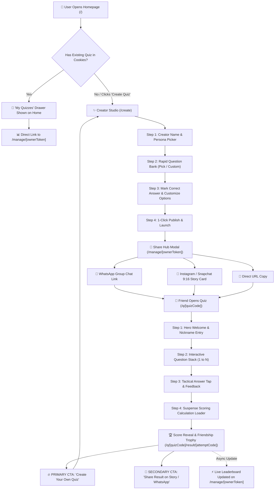
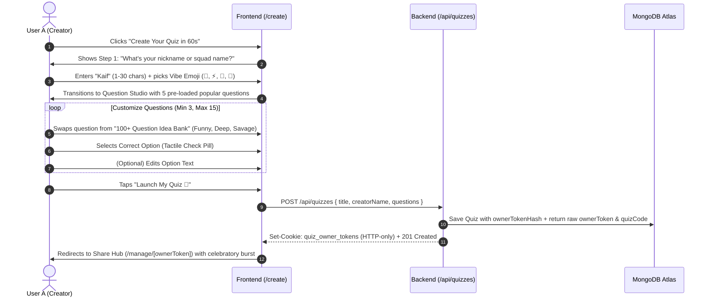
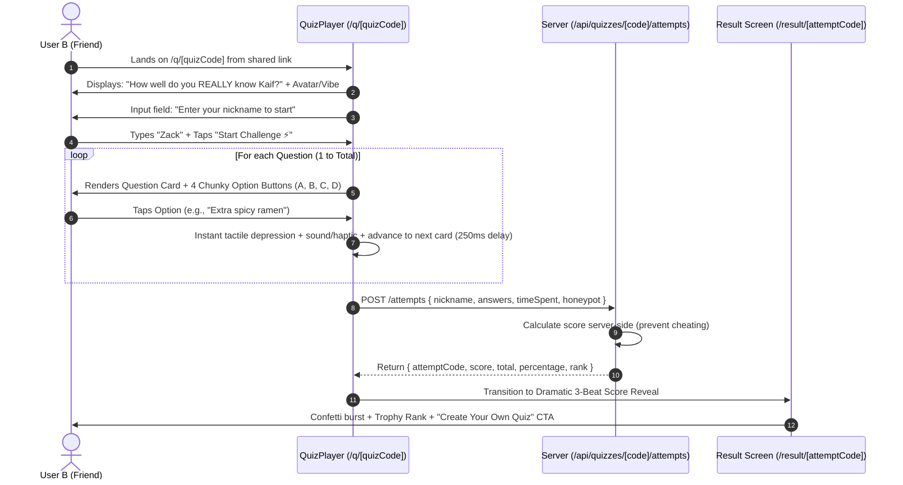
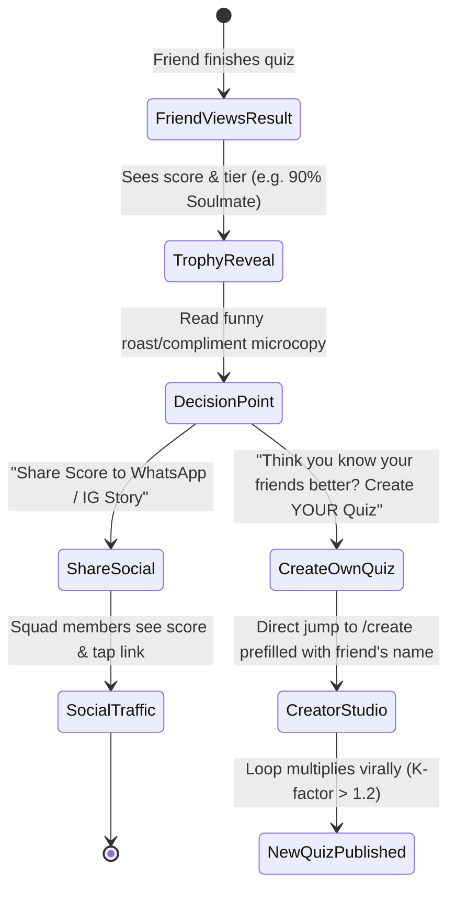
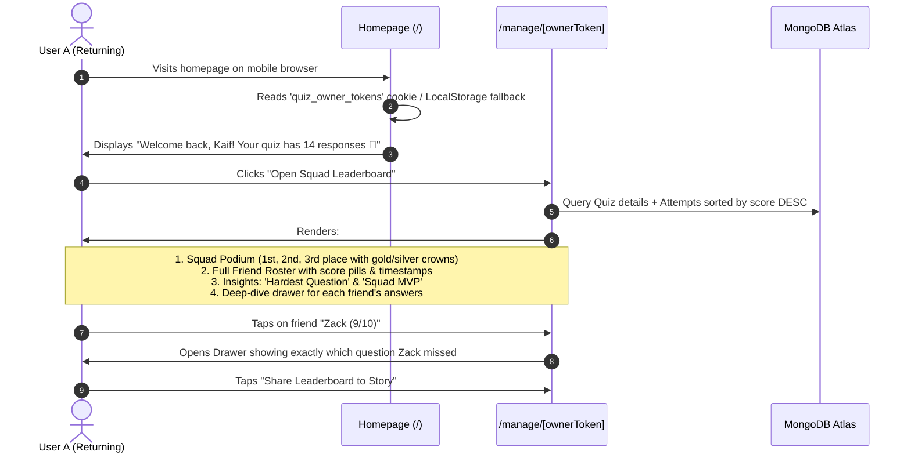
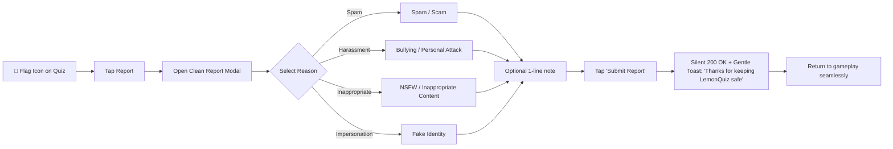

# BestFriend Quiz — User Flows & Journey Architecture
**Document**: `USER_FLOWS.md`  
**Application**: LemonQuiz  
**Target Group**: Gen Z (13–20)  
**Primary Loops**: Creator Onboarding, Friend Gameplay, Viral Re-creation, Squad Dashboard

---

## 1. High-Level System Architecture & Flowchart

---

## 2. Journey 1: The Quiz Creator Flow (Zero-Friction 60s Launch)

### 2.1 The Problem It Solves
Most quiz builders feel like Google Forms or tax software. The LemonQuiz Creator Studio must feel like picking tracks in a music playlist or selecting stickers in an Instagram story.

### 2.2 Detailed Step-by-Step Flow

### 2.3 UX Friction Removers in Creator Flow
1. **Pre-filled Defaults**: The studio never starts with blank inputs. It immediately presents 5 hilarious, universally relatable questions (e.g., *"What is my go-to 2 AM food?", "What is my biggest red flag?", "Who is my celebrity hall pass?"*).
2. **1-Tap Swap**: If the creator doesn't like a question, a single tap on the 🔄 **"Shuffle Idea"** button instantly replaces it with another top-voted template.
3. **Smart Validation**: Visual counter (`5 / 15 questions added`) turns vibrant green when ready. The Launch CTA is always floating and thumb-accessible.

---

## 3. Journey 2: The Friend Player Flow (The Challenge)

### 3.1 The Player Mindset
The friend tapped a link on an Instagram Story or WhatsApp group chat at 11:30 PM. They are curious, slightly competitive, and want to prove they are the "#1 bestie" while avoiding the embarrassment of scoring low.

### 3.2 Detailed Step-by-Step Flow

### 3.3 Anti-Cheating & Integrity Guardrails
- **Zero Client Answer Key**: The client receives only `questionId`, `questionText`, and `options: [{ id, text }]`. The `correctOptionId` is NEVER delivered to the browser.
- **Timing & Bot Filter**: Attempts completed in under 3 seconds or with filled honeypot fields are rejected without disrupting legitimate users.

---

## 4. Journey 3: The Viral Re-Engagement Loop

### 4.1 The Conversion Funnel

### 4.2 Key Viral Trigger Elements
1. **The Revenge CTA**: *"Now it's your turn. Make Kaif take your quiz and see if they remember YOUR favorite things!"*
2. **The High-Score Brag Card**: Ready-to-screenshot 9:16 Instagram Story graphic with user score, tier crown, and link tag placeholder.
3. **The WhatsApp Squad Nudge**: One-tap pre-formatted message:  
   *`"I just scored 9/10 on Kaif's Friendship Quiz! 👑 Can you beat my score? Take it here: https://lemonquiz.com/q/xyz"`*

---

## 5. Journey 4: Returning Creator & Squad Dashboard Flow

---

## 6. Journey 5: Safe Community & Abuse Reporting Flow

---

## 7. Edge Cases & Resilience Strategy

| Edge Case Scenario | UX Handling & Fallback Strategy |
| :--- | :--- |
| **User closes browser mid-quiz** | Answers stored in session memory; reloading prompts "Resume where you left off?" without restarting. |
| **Creator loses owner link** | Auto-restored via HTTP-only cookie + browser fingerprint + local storage mirror. |
| **Friend enters blank or emoji-only name** | Gentle inline tooltip: *"Enter at least 1 letter so your squad recognizes you!"* |
| **Slow network during submission** | Animated arcade spinner with microcopy: *"Calculating your Friendship IQ... Hang tight!"* (Timeout gracefully falls back to retry button). |
| **Quiz reaches rate limit** | Clean friendly countdown modal: *"Whoa speedster! Take a 30s breather before your next attempt."* |
| **Quiz deleted or expired** | Playful 404 screen with illustration: *"This quiz was archived by the creator. Why not start your own?"* |
