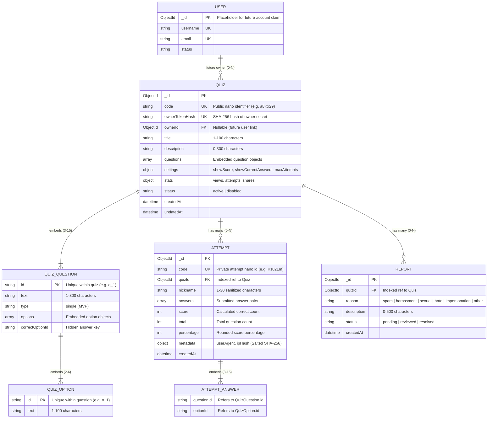
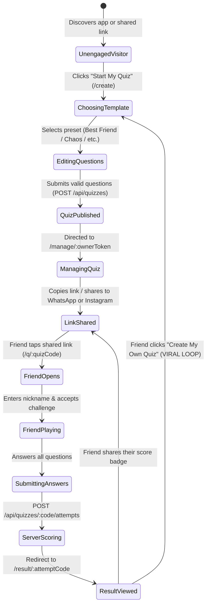
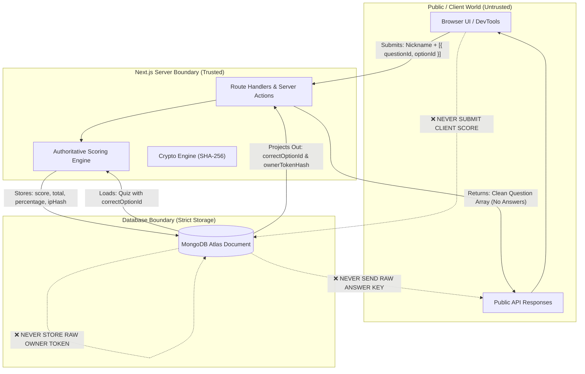

# Project Graph Context & Relationship Topology

> **Project**: Lemon Quiz (Friendship Quiz MVP)  
> **Genre**: Viral Consumer-Social / Interactive Quiz Platform (Ages 12–20)  
> **Purpose**: This document provides a complete graph representation of the project's domain models, cryptographic token flows, state transitions, security boundaries, and architectural topologies.

---

## 1. Domain Entity Relationship Graph

Questions and options are **embedded** directly inside `Quiz` for high performance and zero-join loading. `Attempt` and `Report` are separate referenced collections to support high-volume viral traffic.

---

## 2. Cryptographic Token & Identity Graph

The platform operates without traditional passwords or authentication walls. Security relies on cryptographic one-way hashing and capability URLs.

```mermaid
flowchart TD
    subgraph CREATION ["1. Creation Time"]
        A["Node.js crypto.randomBytes(32)"] -->|Generates| B["Raw Owner Token (64-char hex)"]
        B -->|SHA-256 Hash| C["ownerTokenHash"]
        C -->|Stored in| D[("MongoDB Quizzes Collection")]
        B -->|Set in| E["HTTP-only, SameSite Cookie"]
        B -->|Saved in| F["Browser LocalStorage Backup"]
        B -->|Exposed in| G["Private Owner URL: /manage/:ownerToken"]
    end

    subgraph ACCESS ["2. Dashboard Access"]
        H["Owner visits /manage/:ownerToken"] -->|Extracts Token| I["Server hashes token: SHA-256"]
        I -->|Database Query| J{"Find quiz with matching ownerTokenHash"}
        J -->|Match Found| K["Render Dashboard & Real-Time Rankings"]
        J -->|Not Found| L["Render 404 / Unauthorized"]
    end

    subgraph PUBLIC ["3. Public Player Access"]
        M["Public Quiz Code (nanoid 8)"] -->|Exposed in| N["Public Share URL: /q/:quizCode"]
        N -->|Public Query| O["Strip correctOptionId & ownerTokenHash"]
        O -->|Deliver Safe JSON| P["Player Browser"]
    end

    subgraph ATTEMPT_ID ["4. Attempt Access"]
        Q["Submission generates Attempt Code"] -->|URL Path| R["Result URL: /q/:quizCode/result/:attemptCode"]
        R -->|Access| S["Render Celebratory Score & Viral CTA"]
    end
```

---

## 3. The Core Viral Loop & State Machine Graph

The success of the platform depends on the **K-Factor** ($K \ge 1.0$), ensuring that friends who take a quiz convert into new quiz creators.

---

## 4. System Architecture & Request Pipeline Graph

Every incoming request flows through strict rate limiting, input validation, and security sanitization layers before reaching the database.

```mermaid
flowchart LR
    Client["Client Request (Browser / App)"]
    
    subgraph EDGE_LAYER ["1. Edge / Routing Guard"]
        RateLimiter["Rate Limiting Check (IP Token Bucket)"]
        BodySizeGuard["Body Size Limit Check (<50KB)"]
    end
    
    subgraph VALIDATION_LAYER ["2. Schema & Security Guard"]
        ZodValidator["Zod Schema Validation"]
        HoneypotCheck["Honeypot Anti-Bot Check"]
        Sanitizer["Text Sanitization & Slur Filter"]
    end
    
    subgraph LOGIC_LAYER ["3. Business & Scoring Engine"]
        ScoringEngine["Server-Side Scoring Engine"]
        TokenHasher["Crypto Hash Utility (SHA-256)"]
        SanitizedProjection["Data Projection (Strip Answer Keys)"]
    end
    
    subgraph DATA_LAYER ["4. Database Layer"]
        MongoosePool["Mongoose Cached Connection Pool"]
        MongoCluster[("MongoDB Atlas Database")]
    end
    
    Client --> RateLimiter
    RateLimiter -->|Pass| BodySizeGuard
    RateLimiter -->|Exceeded| Error429["429 Too Many Requests"]
    
    BodySizeGuard --> ZodValidator
    ZodValidator -->|Invalid| Error400["400 Bad Request"]
    ZodValidator -->|Valid| HoneypotCheck
    
    HoneypotCheck -->|Bot Detected| SilentDrop["400 / Silent Reject"]
    HoneypotCheck -->|Human| Sanitizer
    
    Sanitizer --> LogicRouter{"Route Type"}
    LogicRouter -->|Create Quiz| TokenHasher --> MongoosePool
    LogicRouter -->|Submit Attempt| ScoringEngine --> MongoosePool
    LogicRouter -->|Public Load| SanitizedProjection --> MongoosePool
    
    MongoosePool --> MongoCluster
```

---

## 5. Security Trust Boundaries & Data Visibility Graph

This graph defines what data is permitted across each trust boundary.

---

## 6. Route & Component Topology Graph

Map of the Next.js App Router structure and client/server component boundaries:

```mermaid
graph TD
    RootLayout["app/layout.tsx (Server)"]
    
    %% Pages
    HomePage["app/page.tsx (Server: reads cookie)"]
    CreatePage["app/create/page.tsx (Client)"]
    PlayPage["app/q/[quizCode]/page.tsx (Server: async params)"]
    ResultPage["app/q/[quizCode]/result/[attemptCode]/page.tsx (Server)"]
    ManagePage["app/manage/[ownerToken]/page.tsx (Server)"]
    
    %% Components
    QuizCreator["components/quiz/QuizCreator.tsx (Client)"]
    QuestionEditor["components/quiz/QuestionEditor.tsx (Client)"]
    QuizPlayer["components/quiz/QuizPlayer.tsx (Client)"]
    QuizResult["components/quiz/QuizResult.tsx (Client: Confetti)"]
    ShareCard["components/quiz/ShareCard.tsx (Client: Copy/WhatsApp)"]
    Leaderboard["components/dashboard/Ranking.tsx (Client/Server)"]
    ResultList["components/dashboard/ResultList.tsx (Client/Server)"]
    
    %% API Routes
    ApiQuizzes["app/api/quizzes/route.ts (POST)"]
    ApiPublicQuiz["app/api/quizzes/[quizCode]/route.ts (GET / PATCH)"]
    ApiMyQuizzes["app/api/quizzes/my-quizzes/route.ts (POST)"]
    ApiAttempts["app/api/quizzes/[quizCode]/attempts/route.ts (POST)"]
    ApiReports["app/api/reports/route.ts (POST)"]
    ApiAdminReports["app/api/admin/reports/route.ts (GET / PATCH)"]
    
    %% Connections
    RootLayout --> HomePage
    RootLayout --> CreatePage
    RootLayout --> PlayPage
    RootLayout --> ResultPage
    RootLayout --> ManagePage
    
    CreatePage --> QuizCreator
    QuizCreator --> QuestionEditor
    QuizCreator -.->|POST| ApiQuizzes
    
    PlayPage --> QuizPlayer
    QuizPlayer -.->|POST| ApiAttempts
    
    ResultPage --> QuizResult
    ResultPage --> ShareCard
    
    ManagePage --> ShareCard
    ManagePage --> Leaderboard
    ManagePage --> ResultList
    ManagePage -.->|PATCH| ApiPublicQuiz
    HomePage -.->|POST| ApiMyQuizzes
```

---

## 7. Major Module Revision & Architectural Change Log

> **Agent Rule**: Whenever a major or structurally significant change is made to any module, data schema, security policy, or request boundary, add a corresponding entry and update the affected Mermaid diagram(s) above. Do not log minor cosmetic tweaks—only structural and architectural evolutions.

| Revision ID | Date | Affected Module / Diagram | Nature of Change & Impact | Author / Agent |
| :--- | :--- | :--- | :--- | :--- |
| `REV-001` | `2026-10-02` | All Initial Topologies | Baseline system architecture, entity models, and token graphs established for MVP. | AI Agent |
| `REV-002` | `2026-10-02` | Phase 1: Models & Validation | Implemented Mongoose schemas (`Quiz`, `Attempt`, `Report`, `User`), cached DB pool singleton (`lib/db.ts`), Zod validation schemas (`lib/validation.ts`), token crypto utilities (`lib/tokens.ts`), and strict domain types (`types/quiz.ts`). | Backend Engineer |
| `REV-003` | `2026-10-02` | Phase 2: Protection, Rate Limiting & Scoring | Implemented sliding-window rate limiter with LRU eviction (`lib/rate-limit.ts`), quiz creation API route (`POST /api/quizzes`), public quiz loader with zero-leakage projection (`lib/quiz.ts`, `GET /api/quizzes/[quizCode]`), server-side attempt scoring API (`POST /api/quizzes/[quizCode]/attempts`), and abuse reporting API (`POST /api/reports`). | Backend Engineer |
| `REV-004` | `2026-10-02` | Phase 3: Core Viral Loop & Frontend UX | Implemented 4 starter templates (`lib/templates.ts`), styling/verdict utilities (`lib/utils.ts`), safe attempt loader (`lib/quiz.ts`), interactive question editor (`components/quiz/QuestionEditor.tsx`), template-aware quiz creator (`components/quiz/QuizCreator.tsx`, `app/create/page.tsx`), public quiz player with anti-bot/honeypot (`components/quiz/QuizPlayer.tsx`, `app/q/[quizCode]/page.tsx`), and celebratory result view with viral CTA and confetti (`components/quiz/QuizResult.tsx`, `app/q/[quizCode]/result/[attemptCode]/page.tsx`). | Frontend Engineer |
| `REV-005` | `2026-10-02` | Phase 4: Owner Management & Dashboard Foundations | Added owner management domain types (`IOwnerQuizDetails`, `IOwnerAttemptHistory`, `IOwnerDashboardData`, `IUserQuizSummary`), Zod validation schemas (`UpdateQuizStatusSchema`, `SyncOwnerQuizzesSchema`), owner query helpers (`getOwnerQuizByToken`, `getQuizAttemptsForOwner`, `getQuizzesByOwnerTokens`), capability-verified status update handler (`PATCH /api/quizzes/[quizCode]`), and multi-quiz hub sync endpoint (`POST /api/quizzes/my-quizzes`). | Backend Engineer |
| `REV-006` | `2026-10-02` | Phase 4: Owner Dashboard UI & Landing Page Hub | Implemented pure TS SVG QR code engine (`lib/qr.ts`), relative time formatter (`lib/utils.ts`), ShareCard viral hub (`components/quiz/ShareCard.tsx`), live quiz status controls with optimistic updates (`components/dashboard/QuizControls.tsx`), podium rankings leaderboard (`components/dashboard/Ranking.tsx`), friend answer breakdown comparison (`components/dashboard/ResultList.tsx`), owner dashboard layout and server page (`app/manage/[ownerToken]/`), returning user active quizzes sync drawer (`components/dashboard/MyQuizzesSection.tsx`), and conversion-focused landing page (`app/page.tsx`). | Frontend Engineer |
| `REV-007` | `2026-10-02` | Phase 5: Server Hardening, Security & Anti-Abuse | Added comprehensive HTTP security headers (CSP, HSTS, X-Frame-Options, X-Content-Type-Options, Referrer-Policy, Permissions-Policy) in `next.config.ts`, input sanitization and word-boundary leetspeak-aware profanity filter in `lib/sanitize.ts`, security utilities (50KB payload guard, honeypot detection, timing-safe admin key verification) in `lib/security.ts`, rate limiters (`adminApiLimiter`, `quizSyncLimiter`), validation refinements in `lib/validation.ts`, refactored all write endpoints, and implemented authenticated moderation API (`GET / PATCH /api/admin/reports`). | Backend Engineer |
| `REV-008` | `2026-10-02` | Phase 3.5: Design System & Mobile UX Overhaul | Executed comprehensive visual overhaul: implemented centralized Dark/Light design tokens (`app/globals.css`), mounted fixed non-scrolling ambient backdrop with gradient overlay (`app/layout.tsx`), refactored `QuizCreator.tsx` into a 3-stage step wizard (Setup -> Question Editor Deck with sticky dock -> Review with secret answers), upgraded `QuestionEditor.tsx` with 56px touch targets and purple glow states, restyled `QuizPlayer.tsx` stages with letter pills and tactile auto-advance, redesigned `QuizResult.tsx` into a social trophy card with purple/violet confetti, modernized `Ranking.tsx`, `ResultList.tsx`, `ShareCard.tsx`, `QuizControls.tsx`, `MyQuizzesSection.tsx`, `app/page.tsx`, and `app/admin/reports/page.tsx`. | Frontend Engineer |
| `REV-009` | `2026-10-02` | Phase 6 & Cloudflare Edge Fix | Completed Phase 6 and solved Cloudflare Workers DNS SRV incompatibility: implemented DoH SRV resolver in `lib/db.ts` (ADR-010) connecting Atlas replica sets in edge isolate environments without `node:dns` crashes; added dynamic OpenGraph image generator (`app/api/og/route.tsx`) and dynamic metadata; implemented loading skeletons and error boundaries across all routes; created themed 404 page (`app/not-found.tsx`); validated full loop via automated test suite (`tests/e2e_loop.test.ts`). | Primary Orchestrator |

