# Comprehensive SEO & Google Search Indexing Architecture Plan

> **Document Version**: `v1.0.0`  
> **Target Framework**: Next.js 16 (App Router) + React 19 + Vercel Deployment  
> **Status**: Ready for Implementation  
> **Audience**: Engineering, SEO Architects, Product Team  

---

## 1. Executive Summary & Strategic Objectives

LemonQuiz (`lemon-quiz-maniac`) is a high-virality social web application designed for teens and close friend groups (ages 12–20). Users create customized friendship tests in under 60 seconds, broadcast them across WhatsApp, Instagram Stories, Snapchat, and group chats, and track real-time friend rankings on a live podium.

While social sharing drives peer-to-peer loops, **organic search discovery (Google Search & Bing)** represents an immense, untapped viral acquisition channel. High-intent queries such as:
- *"Friendship Quiz 2026"*
- *"BFF Test 2026"*
- *"How well do your friends really know you"*
- *"Best friend quiz maker"*
- *"Buddy meter / Dare quiz"*

generate millions of global monthly impressions. Capturing top-3 Google rankings for these queries requires a battle-tested, enterprise-grade Next.js App Router SEO architecture.

### Key Goals of This Architecture
1. **Dynamic Search Engine Discovery**: Implement native Next.js 16 Route Handlers for dynamic XML sitemaps (`app/sitemap.ts`) indexing public quizzes while caching responses with Incremental Static Regeneration (ISR).
2. **Ironclad Capability URL & Admin Protection**: Configure strict robots exclusions (`app/robots.ts`), layout-level `noindex` directives, and HTTP response headers (`X-Robots-Tag`) to guarantee zero search crawler indexing of private owner tokens (`/manage/[ownerToken]`) and administrative moderation surfaces (`/admin/reports`).
3. **Structured Data Rich Results**: Embed Google-compliant Schema.org JSON-LD scripts (`WebSite`, `WebApplication`, `FAQPage`, `Quiz`, `HowTo`, `BreadcrumbList`) across all indexable routes, qualifying LemonQuiz for SERP rich snippets and expandable FAQ accordions.
4. **Zero-Leakage Security Invariant**: In structured data (`Quiz` schema), expose only question prompts and option choices (`suggestedAnswer`). **Never expose `acceptedAnswer` or `correctOptionId`**, preventing quiz takers from viewing source code to cheat.
5. **Canonicalization & Domain Portability**: Unify origin resolution via a robust `getBaseUrl()` helper supporting Vercel production domains, custom domains, and local development.
6. **Zero Performance Regression**: Ensure zero LCP, CLS, or INP degradation by executing all SEO metadata generation server-side without client-side bundle bloat, accompanied by optimized MongoDB compound indexing (`{ status: 1, updatedAt: -1 }`).

---

## 2. Codebase Audit & Gap Analysis

A comprehensive audit of the existing codebase (`app/`, `lib/`, `models/`, `next.config.ts`) revealed the following current state and technical gaps:

| Architecture Component | Current State | Deficiencies / Vulnerabilities | Target State (Phase 9) |
| :--- | :--- | :--- | :--- |
| **XML Sitemap** | ❌ None (`app/sitemap.ts` missing) | Googlebot has no index manifest for discovering public quizzes or static entry points. | Dynamic `app/sitemap.ts` querying active quizzes from MongoDB with ISR caching (`revalidate = 3600`). |
| **Robots Directives** | ❌ None (`app/robots.ts` missing) | Search engines blindly crawl all routes, potentially indexing private owner management URLs if shared publicly. | `app/robots.ts` allowing `/`, `/create`, `/q/`, `/api/og` while strictly blocking `/manage/`, `/admin/`, `/api/`. |
| **Web App Manifest** | ❌ None (`app/manifest.ts` missing) | Sub-optimal Google mobile ranking; missing PWA installability signals. | Native `app/manifest.ts` with brand theme color (`#8B5CF6`) and mobile icons. |
| **Schema.org Structured Data** | ❌ None | Zero eligibility for Google Rich Snippets, FAQ accordions, or LearningResource badges. | Type-safe `JsonLd` Server Component with `WebSite`, `WebApplication`, `FAQPage`, `Quiz`, and `BreadcrumbList`. |
| **Origin & `metadataBase`** | ⚠️ Hardcoded fallback (`app/layout.tsx:16`) | Points to deprecated Cloudflare worker URL (`workers.dev`) instead of Vercel production domain. | Centralized `getBaseUrl()` checking `NEXT_PUBLIC_APP_URL`, `VERCEL_PROJECT_PRODUCTION_URL`, `VERCEL_URL`. |
| **Canonical Tags** | ⚠️ Partial | Missing `alternates.canonical` on `/`, `/create`, `/q/[quizCode]`, and `/q/[quizCode]/result/[attemptCode]`. | Explicit canonical tags on all indexable routes; result pages canonicalize to parent quiz. |
| **Admin Route Protection** | ❌ Unprotected | `app/admin/reports/page.tsx` is `"use client"` with no metadata or layout; risk of Googlebot indexing admin console. | Server Component `app/admin/layout.tsx` enforcing `robots: { index: false, follow: false, noarchive: true }`. |
| **Owner Dashboard Protection** | ⚠️ Partial | `app/manage/[ownerToken]/page.tsx` has metadata robots, but lacks layout boundary and HTTP headers. | Dedicated `app/manage/[ownerToken]/layout.tsx` + `next.config.ts` `X-Robots-Tag` header rule. |
| **Semantic Heading Hierarchy** | ⚠️ Broken (`app/page.tsx:134`) | Mock question card contains an `<h2>`, causing semantic heading confusion for search engine scrapers. | Replace mock question `<h2>` with semantic `<p>` / styled div; introduce dedicated `<h2>` FAQ & How-To sections. |
| **Database Indexing for Sitemap** | ⚠️ Unoptimized | `Quiz` model indexes `status` and `code`, but lacks compound sorting index `{ status: 1, updatedAt: -1 }`. | Add compound index `{ status: 1, updatedAt: -1 }` on `QuizSchema` for sub-5ms sitemap extraction. |

---

## 3. SEO Architecture & System Topology

The diagram below illustrates how search engine crawlers (Googlebot, Bingbot, Social scrapers) interact with Next.js 16 metadata route handlers, security boundaries, and data pipelines.

```mermaid
flowchart TD
    subgraph Crawlers ["Search Engine Crawlers & Social Bots"]
        GB["Googlebot / Bingbot"]
        GI["Googlebot-Image"]
        SB["Social Bots (WhatsApp, Twitter, FB)"]
    end

    subgraph EdgeRouteHandlers ["Next.js 16 Metadata Route Handlers"]
        R_TXT["app/robots.ts<br/>(/robots.txt)"]
        S_MAP["app/sitemap.ts<br/>(/sitemap.xml with ISR 1h)"]
        W_MAN["app/manifest.ts<br/>(/manifest.webmanifest)"]
    end

    subgraph PublicRoutes ["Indexable Public Pages (SSR / Streaming)"]
        P_HOME["/ (Home Page)<br/>• WebSite & WebApp JSON-LD<br/>• FAQPage Rich Snippet<br/>• Canonical /"]
        P_CREATE["/create (Quiz Creator)<br/>• HowTo & BreadcrumbList<br/>• Canonical /create"]
        P_QUIZ["/q/[quizCode] (Play Screen)<br/>• Quiz Schema (Zero Answer Leak)<br/>• Canonical /q/[quizCode]"]
        OG_API["/api/og (Dynamic OpenGraph)<br/>• Edge ImageResponse (1200x630)"]
    end

    subgraph RestrictedRoutes ["Restricted Capability & Admin Routes"]
        R_RESULT["/q/[quizCode]/result/[attemptCode]<br/>• robots: noindex, follow<br/>• Canonical: /q/[quizCode]"]
        R_MANAGE["/manage/[ownerToken]<br/>• robots: noindex, nofollow, noarchive<br/>• X-Robots-Tag: noindex"]
        R_ADMIN["/admin/reports<br/>• robots: noindex, nofollow, noarchive<br/>• X-Robots-Tag: noindex"]
        R_API["/api/* (Internal Endpoints)<br/>• robots.txt Disallowed"]
    end

    subgraph Storage ["MongoDB Atlas"]
        DB_QUIZ[("Quiz Collection<br/>Index: status + updatedAt")]
    end

    %% Crawler traffic
    GB --> R_TXT
    GB --> S_MAP
    GB --> W_MAN
    GB --> P_HOME
    GB --> P_CREATE
    GB --> P_QUIZ
    GI --> OG_API
    SB --> OG_API

    %% Sitemap DB link
    S_MAP -.->|"Lean query active quizzes (max 10,000)"| DB_QUIZ

    %% Directives
    R_TXT -.->|"ALLOW"| P_HOME
    R_TXT -.->|"ALLOW"| P_CREATE
    R_TXT -.->|"ALLOW"| P_QUIZ
    R_TXT -.->|"ALLOW"| OG_API
    R_TXT -.->|"DISALLOW"| R_MANAGE
    R_TXT -.->|"DISALLOW"| R_ADMIN
    R_TXT -.->|"DISALLOW"| R_API

    classDef allowed fill:#10b98120,stroke:#10b981,stroke-width:2px,color:#d1fae5;
    classDef blocked fill:#ef444420,stroke:#ef4444,stroke-width:2px,color:#fee2e2;
    classDef edge fill:#8b5cf620,stroke:#8b5cf6,stroke-width:2px,color:#ede9fe;
    classDef storage fill:#3b82f620,stroke:#3b82f6,stroke-width:2px,color:#dbeafe;

    class P_HOME,P_CREATE,P_QUIZ,OG_API allowed;
    class R_RESULT,R_MANAGE,R_ADMIN,R_API blocked;
    class R_TXT,S_MAP,W_MAN edge;
    class DB_QUIZ storage;
```



---

## 4. Next.js 16 Metadata Route Handlers Specification

### 4.1 Dynamic XML Sitemap (`app/sitemap.ts`)

Next.js 16 App Router natively translates `app/sitemap.ts` into `/sitemap.xml`.

#### Operational Invariants:
1. **Incremental Static Regeneration (ISR)**: Export `export const revalidate = 3600;` (1 hour) so that heavy crawler traffic hits the Vercel Edge Cache rather than triggering sequential MongoDB queries.
2. **Build-Time Resilience**: If MongoDB Atlas is unavailable or credentials are absent in CI/CD pipeline builds, the query must fail gracefully inside a `try/catch` and return the core static routes (`/`, `/create`), preventing build pipeline termination.
3. **Optimized Database Projection**: Fetch only `code`, `updatedAt`, and `createdAt` using `.lean()` and `.limit(10000)`.
4. **Strict Exclusion Policy**:
   - `/manage/*` MUST NEVER be included (prevents owner token exposure).
   - `/admin/*` MUST NEVER be included.
   - `/api/*` MUST NEVER be included.
   - Individual attempt result pages (`/q/[quizCode]/result/[attemptCode]`) MUST NOT be included to prevent index bloat and crawl budget exhaustion.

#### Code Architecture:
```typescript
// app/sitemap.ts
import type { MetadataRoute } from "next";
import { connectToDatabase } from "@/lib/db";
import { Quiz } from "@/models/Quiz";
import { getBaseUrl } from "@/lib/seo";

export const revalidate = 3600; // Cache sitemap at edge for 1 hour

export default async function sitemap(): Promise<MetadataRoute.Sitemap> {
  const baseUrl = getBaseUrl();

  // 1. Core Static Marketing & Creator Routes
  const staticRoutes: MetadataRoute.Sitemap = [
    {
      url: `${baseUrl}/`,
      lastModified: new Date(),
      changeFrequency: "daily",
      priority: 1.0,
    },
    {
      url: `${baseUrl}/create`,
      lastModified: new Date(),
      changeFrequency: "monthly",
      priority: 0.9,
    },
  ];

  // 2. Dynamic Public Quizzes
  let dynamicQuizRoutes: MetadataRoute.Sitemap = [];
  try {
    await connectToDatabase();
    const activeQuizzes = await Quiz.find({ status: "active" })
      .select("code updatedAt createdAt")
      .sort({ updatedAt: -1 })
      .limit(10000)
      .lean();

    dynamicQuizRoutes = activeQuizzes.map((quiz) => ({
      url: `${baseUrl}/q/${quiz.code}`,
      lastModified: quiz.updatedAt || quiz.createdAt || new Date(),
      changeFrequency: "weekly",
      priority: 0.7,
    }));
  } catch (error) {
    // Non-blocking build failover
    console.error("Failed to query quizzes for sitemap generation:", error);
  }

  return [...staticRoutes, ...dynamicQuizRoutes];
}
```

---

### 4.2 Search Engine Crawler Directives (`app/robots.ts`)

Next.js 16 natively translates `app/robots.ts` into `/robots.txt`.

#### Operational Invariants:
1. **Explicit Whitelist / Blacklist Hierarchy**:
   - **Allowed**: `/`, `/create`, `/q/`, and `/api/og` (critical so that social and image bots can fetch OpenGraph dynamic cards).
   - **Disallowed**: `/manage/`, `/admin/`, and `/api/`.
2. **Sitemap Reference**: Points to `${baseUrl}/sitemap.xml`.
3. **Host Declaration**: Directs crawlers to the authoritative canonical host.

#### Code Architecture:
```typescript
// app/robots.ts
import type { MetadataRoute } from "next";
import { getBaseUrl } from "@/lib/seo";

export default function robots(): MetadataRoute.Robots {
  const baseUrl = getBaseUrl();

  return {
    rules: [
      {
        userAgent: "*",
        allow: ["/", "/create", "/q/", "/api/og*"],
        disallow: ["/manage/*", "/admin/*", "/api/*"],
      },
    ],
    sitemap: `${baseUrl}/sitemap.xml`,
    host: baseUrl,
  };
}
```

---

### 4.3 Web App Manifest (`app/manifest.ts`)

Provides Progressive Web App (PWA) metadata and mobile search installability signals for Google Mobile Search.

#### Operational Invariants:
- `name`: `"LemonQuiz — Friendship Quiz & BFF Test 2026"`
- `short_name`: `"LemonQuiz"`
- `start_url`: `"/"`
- `theme_color`: `"#8B5CF6"` (Matches brand violet)
- `background_color`: `"#080816"` (Matches dark ambient background)
- `display`: `"standalone"`
- `icons`: Points to existing crisp PNG `browser-icon.png` (180x180).

#### Code Architecture:
```typescript
// app/manifest.ts
import type { MetadataRoute } from "next";

export default function manifest(): MetadataRoute.Manifest {
  return {
    name: "LemonQuiz — Friendship Quiz & BFF Test 2026",
    short_name: "LemonQuiz",
    description:
      "Create your personalized friendship test in 60 seconds, share with friends, and see who knows you best.",
    start_url: "/",
    display: "standalone",
    background_color: "#080816",
    theme_color: "#8B5CF6",
    orientation: "portrait",
    icons: [
      {
        src: "/browser-icon.png",
        sizes: "180x180",
        type: "image/png",
        purpose: "any",
      },
    ],
  };
}
```

---

## 5. Schema.org Structured Data (JSON-LD) Specification

### 5.1 Type-Safe & Sanitized JSON-LD Component (`components/seo/JsonLd.tsx`)

To prevent script injection vulnerabilities, all JSON-LD strings must escape `<` to `\u003c`. This is an industry-standard defense against stored Cross-Site Scripting (XSS) when rendering user-submitted quiz titles inside JSON-LD `<script>` tags.

```tsx
// components/seo/JsonLd.tsx
import React from "react";

interface JsonLdProps<T extends Record<string, unknown>> {
  data: T;
}

export function JsonLd<T extends Record<string, unknown>>({ data }: JsonLdProps<T>) {
  return (
    <script
      type="application/ld+json"
      dangerouslySetInnerHTML={{
        __html: JSON.stringify(data).replace(/</g, "\\u003c"),
      }}
    />
  );
}
```

---

### 5.2 Structured Data Schemas by Route

#### 1. Landing Page (`app/page.tsx`):
- **`WebSite`**: Declares site entity and deep search capability.
- **`WebApplication`**: Informs Google Knowledge Graph about the application type, software category, free pricing (`0 USD`), and core features.
- **`FAQPage`**: Qualifies the home page for Google Rich Search expandable FAQ accordions.
- **`BreadcrumbList`**: Single-level root hierarchy.

```json
{
  "@context": "https://schema.org",
  "@graph": [
    {
      "@type": "WebSite",
      "@id": "https://lemonquiz.app/#website",
      "url": "https://lemonquiz.app",
      "name": "LemonQuiz",
      "description": "Create your personalized friendship test in 60 seconds, share with friends, and see who knows you best.",
      "publisher": {
        "@type": "Organization",
        "name": "LemonQuiz",
        "logo": {
          "@type": "ImageObject",
          "url": "https://lemonquiz.app/browser-icon.png"
        }
      }
    },
    {
      "@type": "WebApplication",
      "@id": "https://lemonquiz.app/#webapp",
      "name": "LemonQuiz",
      "url": "https://lemonquiz.app",
      "applicationCategory": "EntertainmentApplication",
      "operatingSystem": "All",
      "browserRequirements": "Requires JavaScript. Requires HTML5.",
      "offers": {
        "@type": "Offer",
        "price": "0",
        "priceCurrency": "USD"
      },
      "featureList": [
        "Create friendship quiz in 60 seconds",
        "Zero login or registration required",
        "Real-time live friend leaderboard",
        "WhatsApp & Instagram QR sharing",
        "100% Teen safe with zero personal data collection"
      ]
    },
    {
      "@type": "FAQPage",
      "@id": "https://lemonquiz.app/#faq",
      "mainEntity": [
        {
          "@type": "Question",
          "name": "What is LemonQuiz?",
          "acceptedAnswer": {
            "@type": "Answer",
            "text": "LemonQuiz is a fast, free friendship quiz and BFF test where you can create a custom 60-second challenge to see how well your friends, besties, and squad really know you."
          }
        },
        {
          "@type": "Question",
          "name": "How do I create a friendship test?",
          "acceptedAnswer": {
            "@type": "Answer",
            "text": "Click 'Create Quiz', pick fun preset questions or write your own custom questions, choose your secret answers, and share your unique quiz link on WhatsApp or Instagram."
          }
        },
        {
          "@type": "Question",
          "name": "Do my friends need an account or app to play?",
          "acceptedAnswer": {
            "@type": "Answer",
            "text": "No! LemonQuiz requires zero login, zero downloads, and zero passwords. Friends can open your link in any mobile browser, enter a nickname, and submit answers in seconds."
          }
        },
        {
          "@type": "Question",
          "name": "How do I check my live leaderboard and scores?",
          "acceptedAnswer": {
            "@type": "Answer",
            "text": "When you create a quiz, you receive a private Owner Dashboard link. Your dashboard features a live real-time leaderboard showing friend rankings, scores, and question breakdowns."
          }
        },
        {
          "@type": "Question",
          "name": "Is LemonQuiz safe and private?",
          "acceptedAnswer": {
            "@type": "Answer",
            "text": "Yes! LemonQuiz collects zero personal data, phone numbers, or email addresses. Scoring is computed server-side to prevent cheating, and inappropriate content can be reported with one click."
          }
        }
      ]
    },
    {
      "@type": "BreadcrumbList",
      "@id": "https://lemonquiz.app/#breadcrumbs",
      "itemListElement": [
        {
          "@type": "ListItem",
          "position": 1,
          "name": "Home",
          "item": "https://lemonquiz.app"
        }
      ]
    }
  ]
}
```

---

#### 2. Public Quiz Page (`app/q/[quizCode]/page.tsx`):
- **`Quiz` / `LearningResource`**: Declares educational/entertainment quiz structure.
- **CRITICAL SECURITY INVARIANT**:
  - In `hasPart`, each question lists `name` (the question prompt) and `suggestedAnswer` (all candidate options).
  - **NEVER** output `acceptedAnswer` or `correctOptionId`. If `acceptedAnswer` were present, any player could inspect page source and cheat with 100% accuracy.
- **`BreadcrumbList`**: Home -> Friendship Quizzes -> Quiz Title.

```json
{
  "@context": "https://schema.org",
  "@graph": [
    {
      "@type": "Quiz",
      "@id": "https://lemonquiz.app/q/ABC123XY#quiz",
      "name": "How Well Do You Know Kaif?",
      "description": "Take this quick 6-question friendship test to see how well you know Kaif and compete on the live leaderboard!",
      "learningResourceType": "Quiz",
      "typicalAgeRange": "12-25",
      "hasPart": [
        {
          "@type": "Question",
          "name": "What is my absolute go-to comfort food late at night?",
          "suggestedAnswer": [
            { "@type": "Answer", "text": "Extra spicy instant ramen" },
            { "@type": "Answer", "text": "Cheesy garlic bread" },
            { "@type": "Answer", "text": "Pepperoni pizza with ranch" },
            { "@type": "Answer", "text": "Cold brew & chocolate cookies" }
          ]
        }
      ]
    },
    {
      "@type": "BreadcrumbList",
      "@id": "https://lemonquiz.app/q/ABC123XY#breadcrumbs",
      "itemListElement": [
        {
          "@type": "ListItem",
          "position": 1,
          "name": "Home",
          "item": "https://lemonquiz.app"
        },
        {
          "@type": "ListItem",
          "position": 2,
          "name": "Create Friendship Quiz",
          "item": "https://lemonquiz.app/create"
        },
        {
          "@type": "ListItem",
          "position": 3,
          "name": "How Well Do You Know Kaif?",
          "item": "https://lemonquiz.app/q/ABC123XY"
        }
      ]
    }
  ]
}
```

---

#### 3. Quiz Creator Page (`app/create/page.tsx`):
- **`HowTo`**: Illustrates the 3-step creation journey to Googlebot.
- **`BreadcrumbList`**: Home -> Create Friendship Quiz.

---

## 6. Canonicalization & Meta Directives Strategy

### 6.1 Centralized Origin Resolver (`lib/seo.ts`)

A unified helper ensures that all metadata, sitemaps, OpenGraph tags, and canonical links reference the correct production URL across environments:

```typescript
// lib/seo.ts
/**
 * Resolves the authoritative base URL of the application.
 * Strips any trailing slashes to guarantee clean canonical concatenation.
 */
export function getBaseUrl(): string {
  if (process.env.NEXT_PUBLIC_APP_URL) {
    return process.env.NEXT_PUBLIC_APP_URL.replace(/\/+$/, "");
  }
  if (process.env.APP_URL) {
    return process.env.APP_URL.replace(/\/+$/, "");
  }
  if (process.env.VERCEL_PROJECT_PRODUCTION_URL) {
    return `https://${process.env.VERCEL_PROJECT_PRODUCTION_URL}`.replace(/\/+$/, "");
  }
  if (process.env.VERCEL_URL) {
    return `https://${process.env.VERCEL_URL}`.replace(/\/+$/, "");
  }
  return "https://lemonquiz.app";
}
```

---

### 6.2 Route-by-Route Canonical & Robots Tag Matrix

| Route Pattern | Canonical URL (`alternates.canonical`) | Robots Meta Directives | Indexing Rationale |
| :--- | :--- | :--- | :--- |
| `/` | `https://lemonquiz.app/` | `index: true, follow: true` | Main SEO landing page and ranking anchor. |
| `/create` | `https://lemonquiz.app/create` | `index: true, follow: true` | High-intent transactional creation page. |
| `/q/[quizCode]` | `https://lemonquiz.app/q/[quizCode]` | `index: true, follow: true` | Individual public quiz challenges for long-tail search. |
| `/q/[quizCode]/result/[attemptCode]` | `https://lemonquiz.app/q/[quizCode]` | `index: false, follow: true, noarchive: true` | **Consolidation**: Canonicalizes back to parent quiz. Prevents crawl budget exhaustion and duplicate content penalties across thousands of transient user scores. |
| `/manage/[ownerToken]` | Omitted or self | `index: false, follow: false, noarchive: true` | **Security Invariant**: Capability URL containing private token. Must NEVER appear in search indexes. |
| `/admin/*` | Omitted or self | `index: false, follow: false, noarchive: true` | **Security Invariant**: Moderation dashboard. Must NEVER appear in search indexes. |

---

### 6.3 Defense-in-Depth HTTP Headers (`next.config.ts`)

In addition to HTML `<meta name="robots">`, configure HTTP response headers in `next.config.ts`. If an unauthorized crawler hits a 404 or 500 error on a private route, the HTTP header immediately halts indexing:

```typescript
// next.config.ts
{
  source: "/manage/:path*",
  headers: [
    {
      key: "X-Robots-Tag",
      value: "noindex, nofollow, noarchive",
    },
  ],
},
{
  source: "/admin/:path*",
  headers: [
    {
      key: "X-Robots-Tag",
      value: "noindex, nofollow, noarchive",
    },
  ],
},
```

---

### 6.4 Dedicated Layout Enforcements for Admin & Owner Routes

To ensure no dynamic errors or child components ever leak without noindex protection:
1. **Create `app/admin/layout.tsx`** (Server Component):
   ```typescript
   import type { Metadata } from "next";

   export const metadata: Metadata = {
     title: "Admin Moderation Console — LemonQuiz",
     robots: { index: false, follow: false, noarchive: true },
   };

   export default function AdminLayout({ children }: { children: React.ReactNode }) {
     return <>{children}</>;
   }
   ```
2. **Create `app/manage/[ownerToken]/layout.tsx`** (Server Component):
   ```typescript
   import type { Metadata } from "next";

   export const metadata: Metadata = {
     title: "Owner Dashboard — LemonQuiz",
     robots: { index: false, follow: false, noarchive: true },
   };

   export default function ManageLayout({ children }: { children: React.ReactNode }) {
     return <>{children}</>;
   }
   ```

---

## 7. On-Page SEO, Content Expansion & Keyword Strategy

### 7.1 Semantic Heading Hierarchy Correction (`app/page.tsx`)

A search engine uses HTML headings (`<h1>` through `<h3>`) to construct an outline of the page's topical authority. 

#### Identified Semantic Glitch:
In `app/page.tsx`, the sample interactive question card preview contained:
```html
<h2 className="text-xl sm:text-2xl font-black text-[var(--text-primary)]...">
  What is my absolute go-to comfort food late at night?
</h2>
```
This falsely signaled to Googlebot that "comfort food" was the primary sub-heading of the entire site!

#### Target Semantic Structure:
```
├── <h1>: How well do your friends really know you? — The #1 Friendship Quiz 2026
├── <p> (formerly sample h2): What is my absolute go-to comfort food late at night?
├── <h2>: Why Close Friends Love LemonQuiz: Simple, Fast & Ultra-Engaging
│   ├── <h3>: Zero Login Required
│   ├── <h3>: Real-Time Live Leaderboard
│   └── <h3>: One-Click Social Sharing
├── <h2>: How to Create Your Friendship Test in 3 Simple Steps
│   ├── <h3>: 1. Choose or Write Your Questions
│   ├── <h3>: 2. Share Your Link to WhatsApp & Stories
│   └── <h3>: 3. Watch Friends Compete on Your Live Podium
└── <h2>: Frequently Asked Questions (FAQ)
    └── Semantic <details>/<summary> accordion matching FAQPage JSON-LD
```

---

### 7.2 High-CTR Meta Title & Description Formulas

```
| Route | Meta Title | Meta Description | Primary Keywords |
| :--- | :--- | :--- | :--- |
| **Home (`/`)** | `LemonQuiz — The #1 Friendship Quiz & BFF Test 2026` | `Find out who knows you best! Create a custom friendship quiz in 60 seconds, share the link on WhatsApp or Instagram Stories, and see who tops your leaderboard.` | friendship quiz, bff test 2026, how well do your friends know you, best friend quiz, buddy meter |
| **Create (`/create`)** | `Create Your Friendship Quiz — LemonQuiz` | `Design your custom friendship test in 60 seconds. Customize fun questions, pick secret answers, and get an instant shareable link for your friends.` | make friendship quiz, create bff test, dare quiz maker |
| **Play (`/q/[quizCode]`)** | `${quiz.title} — Friendship Quiz | LemonQuiz` | `How well do you know the creator of "${quiz.title}"? Answer ${quiz.questions.length} questions and see your rank on the live friend leaderboard!` | play friendship quiz, friend challenge |
| **Result (`/q/[quizCode]/result/[attemptCode]`)** | `${result.nickname}'s Score (${result.percentage}%) on "${result.quizTitle}"` | `See how ${result.nickname} scored on "${result.quizTitle}". Can you beat their score? Take the quiz now!` | friendship score, quiz results |
```

---

### 7.3 Interactive Accessible FAQ Section (`components/home/FaqSection.tsx`)

Adding a clean, native HTML `<details>` and `<summary>` accordion component directly on `app/page.tsx`:
- Zero client-side JavaScript required (pure CSS native disclosure).
- Exactly mirrors the `FAQPage` JSON-LD schema.
- Uses accessible keyboard focus and Tailwind styling consistent with the brand design system.

---

## 8. Core Web Vitals & Performance Impact Analysis

Search engines penalize pages with poor Core Web Vitals (CWV). The implementation plan preserves optimal CWV metrics as follows:

| Metric | Target | Architecture Provision |
| :--- | :--- | :--- |
| **LCP (Largest Contentful Paint)** | `< 1.2s` | • Headless font loading using `next/font/google` (`Geist` with `display: swap`).<br>• Background is a 0 KB CSS ambient radial gradient mesh.<br>• JSON-LD scripts are embedded as static inline text nodes without blocking browser rendering.<br>• Dynamic sitemap uses ISR caching (`revalidate = 3600`) to prevent server latency on crawl bursts. |
| **CLS (Cumulative Layout Shift)** | `0.00` | • FAQ accordion uses semantic HTML disclosure with fixed margins and zero unexpected reflows.<br>• Layout containers reserve dimensions with min-height classes. |
| **INP (Interaction to Next Paint)** | `< 50ms` | • All SEO metadata, JSON-LD, and sitemap generation execute strictly on the server in Server Components.<br>• Zero client-side JavaScript bundle footprint added. |
| **TTFB (Time to First Byte)** | `< 250ms` | • Vercel Edge Network caching for `sitemap.xml`, `robots.txt`, and OpenGraph images (`/api/og`).<br>• `lib/db.ts` cached Mongoose connection pool across serverless container invocations. |

### Database Index Optimization:
In `models/Quiz.ts`, add compound index `{ status: 1, updatedAt: -1 }`.
```typescript
// models/Quiz.ts
QuizSchema.index({ status: 1, updatedAt: -1 });
```
This index ensures that MongoDB can fulfill dynamic sitemap extraction in under **5ms** even when the collection scales past 100,000 quizzes.

---

## 9. Phase 9 Implementation Roadmap: Task Breakdown

The implementation will be executed systematically across 10 discrete tasks (**TASK-901** through **TASK-910**):

```
Phase 9: SEO & Search Indexing Infrastructure
├── TASK-901 [P0]: Dynamic Origin Resolver & Layout Metadata Base (lib/seo.ts & app/layout.tsx)
├── TASK-902 [P0]: Search Engine Directives Handler (app/robots.ts & next.config.ts)
├── TASK-903 [P0]: Dynamic XML Sitemap with ISR & Database Optimization (app/sitemap.ts & models/Quiz.ts)
├── TASK-904 [P0]: Web App Manifest Handler (app/manifest.ts)
├── TASK-905 [P0]: Reusable Sanitized JSON-LD Component (components/seo/JsonLd.tsx)
├── TASK-906 [P0]: Landing Page Structured Data & Semantic Cleanup (app/page.tsx & components/home/FaqSection.tsx)
├── TASK-907 [P0]: Quiz Play Page Zero-Leakage Structured Data & Canonicals (app/q/[quizCode]/page.tsx)
├── TASK-908 [P1]: Result Page Canonical Consolidation & Noindex Directives (app/q/[quizCode]/result/[attemptCode]/page.tsx)
├── TASK-909 [P0]: Owner & Admin Capability URL Search Cloaking (app/manage/[ownerToken]/layout.tsx & app/admin/layout.tsx)
└── TASK-910 [P0]: Comprehensive Verification, Automated Tests & Schema Validation
```

### Detailed Task Specifications:

#### TASK-901 `[P0]`: Dynamic Origin Resolver & Layout Metadata Base
- **Files**: `lib/seo.ts`, `app/layout.tsx`
- **Actions**:
  1. Create `lib/seo.ts` with `getBaseUrl()` prioritizing `NEXT_PUBLIC_APP_URL`, `VERCEL_PROJECT_PRODUCTION_URL`, `VERCEL_URL`, and stripping trailing slashes.
  2. Update `app/layout.tsx` to set `metadataBase: new URL(getBaseUrl())`.
  3. Enrich global metadata with keyword array, authors, creator, publisher, formatDetection, and OpenGraph/Twitter cards.

#### TASK-902 `[P0]`: Search Engine Directives Handler (`app/robots.ts`)
- **Files**: `app/robots.ts`, `next.config.ts`
- **Actions**:
  1. Implement `app/robots.ts` returning Googlebot/Bingbot rules.
  2. Explicitly allow `/`, `/create`, `/q/`, `/api/og*`.
  3. Explicitly disallow `/manage/*`, `/admin/*`, `/api/*`.
  4. Link `sitemap: ${baseUrl}/sitemap.xml` and `host: baseUrl`.
  5. Add `X-Robots-Tag: noindex, nofollow, noarchive` in `next.config.ts` headers for `/manage/:path*` and `/admin/:path*`.

#### TASK-903 `[P0]`: Dynamic XML Sitemap with ISR & Database Optimization
- **Files**: `app/sitemap.ts`, `models/Quiz.ts`
- **Actions**:
  1. Add compound index `{ status: 1, updatedAt: -1 }` on `QuizSchema` in `models/Quiz.ts`.
  2. Implement `app/sitemap.ts` with `export const revalidate = 3600;`.
  3. Map static routes `/` (priority 1.0, daily) and `/create` (priority 0.9, monthly).
  4. Query active quizzes (`status: 'active'`) with `.select("code updatedAt createdAt").sort({ updatedAt: -1 }).limit(10000).lean()`.
  5. Include graceful `try/catch` fallback so CI/CD builds succeed even if MongoDB is disconnected.

#### TASK-904 `[P0]`: Web App Manifest Handler (`app/manifest.ts`)
- **Files**: `app/manifest.ts`
- **Actions**:
  1. Implement `app/manifest.ts` returning `MetadataRoute.Manifest`.
  2. Define brand name, theme color (`#8B5CF6`), dark background (`#080816`), standalone display, and icon references.

#### TASK-905 `[P0]`: Reusable Sanitized JSON-LD Component
- **Files**: `components/seo/JsonLd.tsx`
- **Actions**:
  1. Implement generic Server Component `JsonLd<T>`.
  2. Escape all `<` characters to `\u003c` to neutralize stored XSS vulnerabilities.

#### TASK-906 `[P0]`: Landing Page Structured Data & Semantic Cleanup
- **Files**: `app/page.tsx`, `components/home/FaqSection.tsx`
- **Actions**:
  1. In `app/page.tsx`, replace mock interactive question `<h2>` with semantic `<p>` / styled div.
  2. Add `components/home/FaqSection.tsx` featuring 5 high-converting Q&As using accessible `<details>` / `<summary>` accordions.
  3. Add "How It Works in 3 Steps" semantic block with clean `<h2>` / `<h3>` hierarchy.
  4. Inject `WebSite`, `WebApplication`, `FAQPage`, and `BreadcrumbList` schemas via `<JsonLd />`.
  5. Add explicit `alternates: { canonical: "/" }` and high-CTR titles/descriptions.

#### TASK-907 `[P0]`: Quiz Play Page Zero-Leakage Structured Data & Canonicals
- **Files**: `app/q/[quizCode]/page.tsx`
- **Actions**:
  1. In `generateMetadata`, add `alternates: { canonical: `/q/${quizCode}` }`.
  2. In `QuizPage`, inject `Quiz` Schema and `BreadcrumbList`.
  3. **Strict Invariant**: Populate `hasPart` with question prompts and `suggestedAnswer` options. **Never include `acceptedAnswer` or `correctOptionId`**.

#### TASK-908 `[P1]`: Result Page Canonical Consolidation & Noindex Directives
- **Files**: `app/q/[quizCode]/result/[attemptCode]/page.tsx`
- **Actions**:
  1. Set `alternates: { canonical: `/q/${quizCode}` }` to consolidate link equity to the root quiz.
  2. Set `robots: { index: false, follow: true, noarchive: true }` to keep individual score instances out of Google search while allowing bots to follow internal links.

#### TASK-909 `[P0]`: Owner & Admin Capability URL Search Cloaking
- **Files**: `app/manage/[ownerToken]/layout.tsx`, `app/admin/layout.tsx`
- **Actions**:
  1. Create Server Component `app/admin/layout.tsx` enforcing `robots: { index: false, follow: false, noarchive: true }`.
  2. Create Server Component `app/manage/[ownerToken]/layout.tsx` enforcing `robots: { index: false, follow: false, noarchive: true }`.

#### TASK-910 `[P0]`: Comprehensive Verification, Automated Tests & Schema Validation
- **Files**: `tests/seo.test.ts`
- **Actions**:
  1. Create automated test suite validating:
     - `/robots.txt` endpoint structure and disallow rules.
     - `/sitemap.xml` endpoint generation and exclusion of private tokens.
     - Presence of canonical tags on `/`, `/create`, `/q/[code]`.
     - Presence of `noindex` directives on `/manage/[token]` and `/admin/reports`.
     - Zero leakage of `correctOptionId` in JSON-LD output.
  2. Execute `npm run lint` and `npm run build` to verify clean production compile.

---

## 10. Verification & Quality Assurance Checklist

Prior to production deployment, the implementation will be validated against the following criteria:

- [ ] **Google Rich Results Validation**: Paste generated HTML for `/` and `/q/[code]` into Google Rich Results Test tool; verify 0 errors and valid `FAQPage` and `Quiz` entities.
- [ ] **Schema.org Linter**: Verify all JSON-LD schemas pass validation on `validator.schema.org`.
- [ ] **Answer Key Leakage Audit**: Inspect `view-source:` of `/q/[quizCode]`; ensure `correctOptionId` does not appear anywhere in `<head>`, `<body>`, or `<script>` tags.
- [ ] **Robots Exclusion Audit**: Crawl site with `curl -I` and user-agent `Googlebot`; verify `X-Robots-Tag: noindex, nofollow, noarchive` on `/manage/...` and `/admin/...`.
- [ ] **Sitemap Validation**: Fetch `/sitemap.xml`; confirm `<loc>`, `<lastmod>`, `<changefreq>`, and `<priority>` conform to Sitemap XML 0.9 protocol.
- [ ] **Lighthouse SEO Score**: Run Google Chrome Lighthouse audit; confirm 100/100 score on SEO category.
- [ ] **Build Pipeline**: Run `npm run build`; confirm Turbopack generates all static routes, dynamic handlers compile without error, and total bundle size remains lean.
