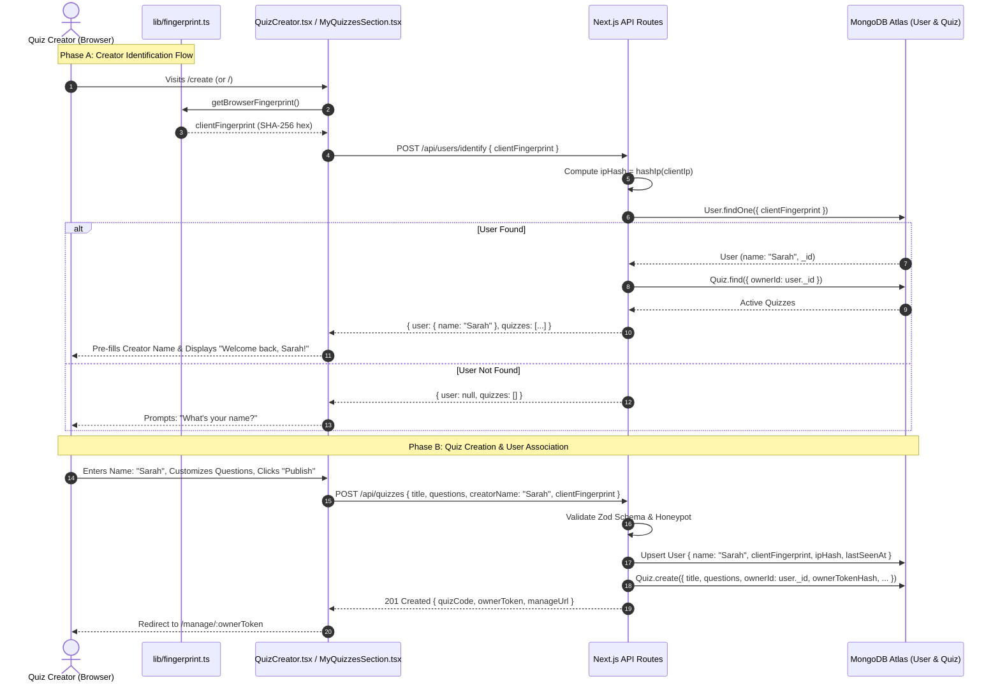

# Implementation Plan: Browser Blueprint User Identification & Creator Name Flow

> **Project**: Lemon Quiz (`lemon-quiz-maniac`)  
> **Status**: Proposed / Ready for Review  
> **Target Version**: `v1.4.0` (Phase 8)  
> **Author**: Antigravity Full-Stack Architect  

---

## 1. Executive Summary & Objectives

The goal of this implementation is to introduce **zero-friction, passwordless user identity** using a **client-side browser blueprint (fingerprint)** combined with **salted server-side IP hashing**. 

### Key Deliverables:
1. **Mandatory Creator Name in Quiz Creator**: Before customizing questions, users enter their name (e.g., "Sarah"). The quiz title dynamically adapts to `"How Well Do You Know Sarah?"`.
2. **Zero-Dependency Browser Blueprint (`lib/fingerprint.ts`)**: Generates a high-entropy, deterministic 64-character SHA-256 hash using native browser APIs (Canvas 2D, Screen dimensions, Timezone, Hardware concurrency, Touch points, Platform) without external library overhead (<3ms, 0 KB bundle increase).
3. **Database User Model Activation (`models/User.ts`)**: Upgrades the dormant `User` model to store `name`, `clientFingerprint`, `ipHash`, `lastSeenAt`, and `status`.
4. **Footprint-Based Quiz Linking**: When creating a quiz, the user's browser blueprint is associated with the `Quiz` document via `ownerId`.
5. **Instant Returning User Recovery (`/api/users/identify`)**: When a returning user opens the landing page or quiz hub, their browser footprint is matched against MongoDB. If matched with network locality (`ipHash`), their profile and active quizzes are automatically loaded even if cookies or `localStorage` were cleared.

---

## 2. Architectural Design & Security Model



---

## 3. Privacy & Security Invariants

In strict adherence to [`agent/RULES.md`](file:///home/kaif/storage/Codes/Fun-projects/lemon-quiz-maniac/agent/RULES.md):
- **No PII Collection**: Only first names / nicknames (1–50 characters) are accepted. No emails, phone numbers, or passwords.
- **Salted IP Hashing**: Raw IP addresses are **never** stored in MongoDB. The existing utility `hashIp(clientIp)` (SHA-256 with server salt) is used exclusively.
- **Zero Answer Key Leakage**: Public quiz payloads never expose `correctOptionId` or `ownerTokenHash`.
- **NAT / Shared Wi-Fi Collision Prevention**: 
  - Multiple users on the same Wi-Fi (e.g. school, university, coffee shop) share the same IP.
  - The lookup **MUST NOT** identify users purely by `ipHash`. The primary identifier is `clientFingerprint`. `ipHash` acts as a corroborating network signal and security anchor.
- **Graceful Fallback**: If a privacy extension blocks canvas or hardware queries, the blueprint falls back to a generated local UUID, ensuring 100% quiz creation reliability.

---

## 4. Technical Specifications & File Changes

### 4.1 Client Browser Blueprint (`lib/fingerprint.ts`)
Creates a client-side zero-dependency utility using native Web APIs:
- `window.screen` (width, height, colorDepth)
- `Intl.DateTimeFormat().resolvedOptions().timeZone`
- `navigator.language` & `navigator.languages`
- `navigator.hardwareConcurrency` & `navigator.maxTouchPoints`
- `navigator.platform`
- Canvas 2D geometric & color render hash
- Native `window.crypto.subtle.digest("SHA-256", buffer)`
- Cached in `sessionStorage` for instantaneous sub-1ms re-reads.

### 4.2 Updated User Model & Types (`models/User.ts` & `types/quiz.ts`)
```ts
export interface IUser {
  _id?: Types.ObjectId | string;
  name: string;
  clientFingerprint: string;
  ipHash: string;
  userAgent?: string;
  lastSeenAt: Date;
  status: "active" | "suspended";
  createdAt?: Date | string;
  updatedAt?: Date | string;
}
```
**Mongoose Indexes**:
- `{ clientFingerprint: 1 }` (unique/sparse index for lightning-fast lookup)
- `{ ipHash: 1 }`
- `{ clientFingerprint: 1, ipHash: 1 }`

### 4.3 User Identification Endpoint (`app/api/users/identify/route.ts`)
- **Method**: `POST`
- **Rate Limit**: 30 requests / 10 minutes per IP (`userIdentifyLimiter`).
- **Input**: `{ clientFingerprint: string }`
- **Logic**:
  1. Extract client IP and compute `ipHash`.
  2. Query `User.findOne({ clientFingerprint, status: "active" }).lean()`.
  3. If found:
     - Asynchronously update `lastSeenAt` and `ipHash` (if user changed network from Wi-Fi to cellular).
     - Fetch their quizzes: `Quiz.find({ ownerId: user._id, status: "active" })`.
     - Return `{ success: true, user: { name: user.name, id: user._id }, quizzes: [...] }`.
  4. If not found:
     - Return `{ success: true, user: null, quizzes: [] }`.

### 4.4 Update Quiz Creation Route (`app/api/quizzes/route.ts`)
- Update `CreateQuizSchema` in [`lib/validation.ts`](file:///home/kaif/storage/Codes/Fun-projects/lemon-quiz-maniac/lib/validation.ts):
  - `creatorName`: `z.string().min(1).max(50).trim()`
  - `clientFingerprint`: `z.string().max(64).optional()`
- In `POST /api/quizzes`:
  - Sanitize `creatorName` with [`lib/sanitize.ts`](file:///home/kaif/storage/Codes/Fun-projects/lemon-quiz-maniac/lib/sanitize.ts).
  - Upsert `User` record with `{ name: sanitizedCreatorName, clientFingerprint, ipHash, lastSeenAt: new Date() }`.
  - Set `createdQuiz.ownerId = user._id`.

### 4.5 Quiz Creator UI Overhaul (`components/quiz/QuizCreator.tsx`)
- In Stage 1 (Setup):
  - Add **"What is your name?"** input at the very top of the setup card before question customizing.
  - Pre-fill `creatorName` if already identified by browser blueprint.
  - Dynamically update title suggestion as user types name (e.g. `How Well Do You Know ${creatorName}?`).
  - Validation requires non-empty creator name before moving to Question Wizard (Stage 2).
  - 56px minimum touch target height for mobile friendliness.

### 4.6 Homepage & MyQuizzes Recovery (`components/dashboard/MyQuizzesSection.tsx`)
- In `useEffect` on mount:
  - Fetch browser blueprint from `lib/fingerprint.ts`.
  - Call `/api/users/identify`.
  - If user identified and has quizzes, merge them into the active quizzes grid.
  - Display personalized greeting: `Welcome back, {userName}! 👋`.

---

## 5. Phased Task Breakdown & Execution Plan

| Task ID | Component | Details | Priority |
| :--- | :--- | :--- | :--- |
| **TASK-801** | `lib/fingerprint.ts` | Implement zero-dependency client-side browser fingerprint generator using Web Crypto SHA-256 and Canvas 2D. | **P0** |
| **TASK-802** | `models/User.ts` & `types/quiz.ts` | Update `IUser` interface and Mongoose `UserSchema` with `name`, `clientFingerprint`, `ipHash`, and compound indexes. | **P0** |
| **TASK-803** | `lib/validation.ts` | Add `creatorName` and `clientFingerprint` to `CreateQuizSchema`; create `IdentifyUserSchema`. | **P0** |
| **TASK-804** | `app/api/users/identify/route.ts` | Implement `POST /api/users/identify` with rate limiting, IP hashing, user lookup, and quiz loading. | **P0** |
| **TASK-805** | `app/api/quizzes/route.ts` | Update quiz creation to upsert `User` record and link `Quiz.ownerId = user._id`. | **P0** |
| **TASK-806** | `components/quiz/QuizCreator.tsx` | Refactor Stage 1 setup form to require Creator Name input first with auto-title generation and blueprint detection. | **P0** |
| **TASK-807** | `components/dashboard/MyQuizzesSection.tsx` & `app/page.tsx` | Wire up automatic returning user detection and quiz recovery via browser footprint. | **P1** |
| **TASK-808** | Verification & Test Suite | Add automated tests in `tests/e2e_loop.test.ts` verifying creator name requirement, user creation, footprint lookup, and privacy guarantees. | **P0** |

---

## 6. Verification Criteria

- [ ] `npm run lint`: Zero errors, zero warnings.
- [ ] `npm run build`: Production build passes cleanly with Turbopack.
- [ ] Creator Name is required when initiating a quiz; users cannot proceed to question editing with an empty name.
- [ ] User document is created in MongoDB with `name`, `clientFingerprint`, and salted `ipHash`.
- [ ] Returning to `/` or `/create` on the same browser recognizes the user and pre-fills their name and loads their quizzes.
- [ ] Salted IP hash invariant verified; raw IP is never stored.
- [ ] Mobile touch targets remain >= 56px and UI strictly uses Lucide React icons.
